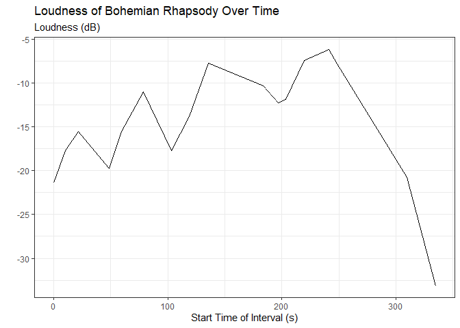
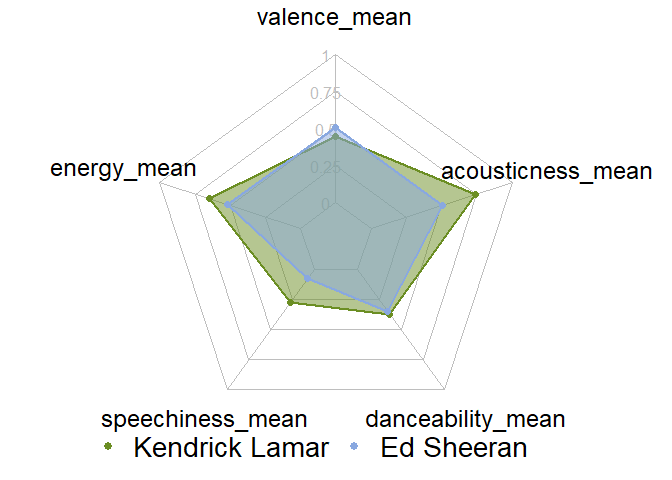

<!-- README.md is generated from README.Rmd. Please edit that file -->

# SpotifyRgato365

## Overview

The “SpotifyRgato365” package is an R package for utilizing Spotify’s
Web API for developers to pull information on a variety of topics,
including artists, albums, tracks, and genres. By just inputing an
artist’s name, you can gather a ton of fascinating data, including a
summary of the artists danceability, valence, and energy, among many
other measurements!

## Installation

``` r
devtools::install_github("AdamDelRio/SpotifyRgato365")
#> Downloading GitHub repo AdamDelRio/SpotifyRgato365@HEAD
#> Installing 16 packages: rlang, Rcpp, later, fastmap, glue, cli, digest, jsonlite, utf8, fansi, stringi, fs, cachem, curl, promises, data.table
#> Installing packages into 'C:/Users/adamd/AppData/Local/R/win-library/4.3'
#> (as 'lib' is unspecified)
#> Warning: cannot remove prior installation of package 'rlang'
#> Warning in file.copy(savedcopy, lib, recursive = TRUE): problem copying
#> C:\Users\adamd\AppData\Local\R\win-library\4.3\00LOCK\rlang\libs\x64\rlang.dll
#> to C:\Users\adamd\AppData\Local\R\win-library\4.3\rlang\libs\x64\rlang.dll:
#> Permission denied
#> Warning: restored 'rlang'
#> Warning: cannot remove prior installation of package 'Rcpp'
#> Warning in file.copy(savedcopy, lib, recursive = TRUE): problem copying
#> C:\Users\adamd\AppData\Local\R\win-library\4.3\00LOCK\Rcpp\libs\x64\Rcpp.dll to
#> C:\Users\adamd\AppData\Local\R\win-library\4.3\Rcpp\libs\x64\Rcpp.dll:
#> Permission denied
#> Warning: restored 'Rcpp'
#> Warning: cannot remove prior installation of package 'later'
#> Warning in file.copy(savedcopy, lib, recursive = TRUE): problem copying
#> C:\Users\adamd\AppData\Local\R\win-library\4.3\00LOCK\later\libs\x64\later.dll
#> to C:\Users\adamd\AppData\Local\R\win-library\4.3\later\libs\x64\later.dll:
#> Permission denied
#> Warning: restored 'later'
#> Warning: cannot remove prior installation of package 'fastmap'
#> Warning in file.copy(savedcopy, lib, recursive = TRUE): problem copying
#> C:\Users\adamd\AppData\Local\R\win-library\4.3\00LOCK\fastmap\libs\x64\fastmap.dll
#> to C:\Users\adamd\AppData\Local\R\win-library\4.3\fastmap\libs\x64\fastmap.dll:
#> Permission denied
#> Warning: restored 'fastmap'
#> Warning: cannot remove prior installation of package 'glue'
#> Warning in file.copy(savedcopy, lib, recursive = TRUE): problem copying
#> C:\Users\adamd\AppData\Local\R\win-library\4.3\00LOCK\glue\libs\x64\glue.dll to
#> C:\Users\adamd\AppData\Local\R\win-library\4.3\glue\libs\x64\glue.dll:
#> Permission denied
#> Warning: restored 'glue'
#> Warning: cannot remove prior installation of package 'cli'
#> Warning in file.copy(savedcopy, lib, recursive = TRUE): problem copying
#> C:\Users\adamd\AppData\Local\R\win-library\4.3\00LOCK\cli\libs\x64\cli.dll to
#> C:\Users\adamd\AppData\Local\R\win-library\4.3\cli\libs\x64\cli.dll: Permission
#> denied
#> Warning: restored 'cli'
#> Warning: cannot remove prior installation of package 'digest'
#> Warning in file.copy(savedcopy, lib, recursive = TRUE): problem copying
#> C:\Users\adamd\AppData\Local\R\win-library\4.3\00LOCK\digest\libs\x64\digest.dll
#> to C:\Users\adamd\AppData\Local\R\win-library\4.3\digest\libs\x64\digest.dll:
#> Permission denied
#> Warning: restored 'digest'
#> Warning: cannot remove prior installation of package 'jsonlite'
#> Warning in file.copy(savedcopy, lib, recursive = TRUE): problem copying
#> C:\Users\adamd\AppData\Local\R\win-library\4.3\00LOCK\jsonlite\libs\x64\jsonlite.dll
#> to
#> C:\Users\adamd\AppData\Local\R\win-library\4.3\jsonlite\libs\x64\jsonlite.dll:
#> Permission denied
#> Warning: restored 'jsonlite'
#> Warning: cannot remove prior installation of package 'utf8'
#> Warning in file.copy(savedcopy, lib, recursive = TRUE): problem copying
#> C:\Users\adamd\AppData\Local\R\win-library\4.3\00LOCK\utf8\libs\x64\utf8.dll to
#> C:\Users\adamd\AppData\Local\R\win-library\4.3\utf8\libs\x64\utf8.dll:
#> Permission denied
#> Warning: restored 'utf8'
#> Warning: cannot remove prior installation of package 'fansi'
#> Warning in file.copy(savedcopy, lib, recursive = TRUE): problem copying
#> C:\Users\adamd\AppData\Local\R\win-library\4.3\00LOCK\fansi\libs\x64\fansi.dll
#> to C:\Users\adamd\AppData\Local\R\win-library\4.3\fansi\libs\x64\fansi.dll:
#> Permission denied
#> Warning: restored 'fansi'
#> Warning: cannot remove prior installation of package 'stringi'
#> Warning in file.copy(savedcopy, lib, recursive = TRUE): problem copying
#> C:\Users\adamd\AppData\Local\R\win-library\4.3\00LOCK\stringi\libs\x64\stringi.dll
#> to C:\Users\adamd\AppData\Local\R\win-library\4.3\stringi\libs\x64\stringi.dll:
#> Permission denied
#> Warning: restored 'stringi'
#> Warning: cannot remove prior installation of package 'fs'
#> Warning in file.copy(savedcopy, lib, recursive = TRUE): problem copying
#> C:\Users\adamd\AppData\Local\R\win-library\4.3\00LOCK\fs\libs\x64\fs.dll to
#> C:\Users\adamd\AppData\Local\R\win-library\4.3\fs\libs\x64\fs.dll: Permission
#> denied
#> Warning: restored 'fs'
#> Warning: cannot remove prior installation of package 'cachem'
#> Warning in file.copy(savedcopy, lib, recursive = TRUE): problem copying
#> C:\Users\adamd\AppData\Local\R\win-library\4.3\00LOCK\cachem\libs\x64\cachem.dll
#> to C:\Users\adamd\AppData\Local\R\win-library\4.3\cachem\libs\x64\cachem.dll:
#> Permission denied
#> Warning: restored 'cachem'
#> Warning: cannot remove prior installation of package 'curl'
#> Warning in file.copy(savedcopy, lib, recursive = TRUE): problem copying
#> C:\Users\adamd\AppData\Local\R\win-library\4.3\00LOCK\curl\libs\x64\curl.dll to
#> C:\Users\adamd\AppData\Local\R\win-library\4.3\curl\libs\x64\curl.dll:
#> Permission denied
#> Warning: restored 'curl'
#> Warning: cannot remove prior installation of package 'promises'
#> Warning in file.copy(savedcopy, lib, recursive = TRUE): problem copying
#> C:\Users\adamd\AppData\Local\R\win-library\4.3\00LOCK\promises\libs\x64\promises.dll
#> to
#> C:\Users\adamd\AppData\Local\R\win-library\4.3\promises\libs\x64\promises.dll:
#> Permission denied
#> Warning: restored 'promises'
#> Warning: cannot remove prior installation of package 'data.table'
#> Warning in file.copy(savedcopy, lib, recursive = TRUE): problem copying
#> C:\Users\adamd\AppData\Local\R\win-library\4.3\00LOCK\data.table\libs\x64\data_table.dll
#> to
#> C:\Users\adamd\AppData\Local\R\win-library\4.3\data.table\libs\x64\data_table.dll:
#> Permission denied
#> Warning: restored 'data.table'
#> Installing package into 'C:/Users/adamd/AppData/Local/R/win-library/4.3'
#> (as 'lib' is unspecified)
```

## Authentication

Firstly, create an account
[here](https://developer.spotify.com/my-applications/#!/applications)
for the Spotify for Developers Web API. After creating an account,
create a dashboard, then check the settings for your client and secret
id.

Then, set both ids in your environment, as the function
get_spotify_access_token() pulls these varaibles from the environment.
Alternatively, you can pass these varaibles into the function manually
and store the returned string, but remember to include this new varible
in all function calls.

``` r
Sys.setenv(SPOTIFY_CLIENT_ID = "xxxxxxxxxxxxxxxxxxxxx")
Sys.setenv(SPOTIFY_CLIENT_SECRET = "xxxxxxxxxxxxxxxxxxxxx")
#OR
access_token <- get_spotify_access_token(SPOTIFY_CLIENT_ID = "xxxxxxxxxxxxxxxxxxxxx", 
                                         SPOTIFY_CLIENT_SECRET = "xxxxxxxxxxxxxxxxxxxxx")
```

## Usage

### Which One Direction Member Is The Most Danceable?

``` r
members <- get_artists_summary(queries = c("Harry Styles", "ZAYN", "Liam Payne", "Niall Horan", "Louis Tomlinson"))
members %>%
  dplyr::select(artist_name, danceability_mean) %>% 
  dplyr::arrange(desc(danceability_mean)) %>%
  dplyr::rename("Artist Name" = artist_name,
                "Mean Danceability" = danceability_mean) %>%
  kable(format = "markdown")
```

| Artist Name     | Mean Danceability |
|:----------------|------------------:|
| Liam Payne      |         0.6442791 |
| Harry Styles    |         0.5682973 |
| ZAYN            |         0.5539911 |
| Louis Tomlinson |         0.5527065 |
| Niall Horan     |         0.5093964 |

### How Loud Does “Bohemian Rhapsody” Get Throughout The Song?

``` r
rhap <- get_track_sections(query = "Bohemian Rhapsody")
rhap %>%
  dplyr::select(track_name,
                start,
                loudness) %>% 
  ggplot2::ggplot(mapping = aes(x = start, y = loudness)) + 
  ggplot2::geom_line() + 
  ggplot2::theme_bw() + 
  ggplot2::labs(title = "Loudness of Bohemian Rhapsody Over Time",
                subtitle = "Loudness (dB)",
                x = "Start Time of Interval (s)",
                y = "")
```



### Of The Top Hip-Hop Artists, Which 5 Have The Most Followers?

``` r
hop <- get_genre_artists(genre = "hip-hop")
hop %>% 
  dplyr::select(artist_name, 
                followers_total) %>% 
  dplyr::arrange(desc(followers_total)) %>% 
  dplyr::slice_head(n = 5) %>% 
  dplyr::rename("Artist Name" = artist_name, 
                "Total Followers" = followers_total) %>% 
  knitr::kable(format = "markdown")
```

| Artist Name    | Total Followers |
|:---------------|----------------:|
| Drake          |        89793617 |
| Eminem         |        86441471 |
| XXXTENTACION   |        45447738 |
| Nicki Minaj    |        31603775 |
| Kendrick Lamar |        30658778 |

### How Does The Average Valence, Energy, Speechiness, Danceability, And Acousticness Of Kendrick Lamar Compare To Ed Sheeran

``` r
create_average_artists_radar_chart(queries = c("Kendrick Lamar", "Ed Sheeran"), vars = c("danceability", "acousticness"))
```


